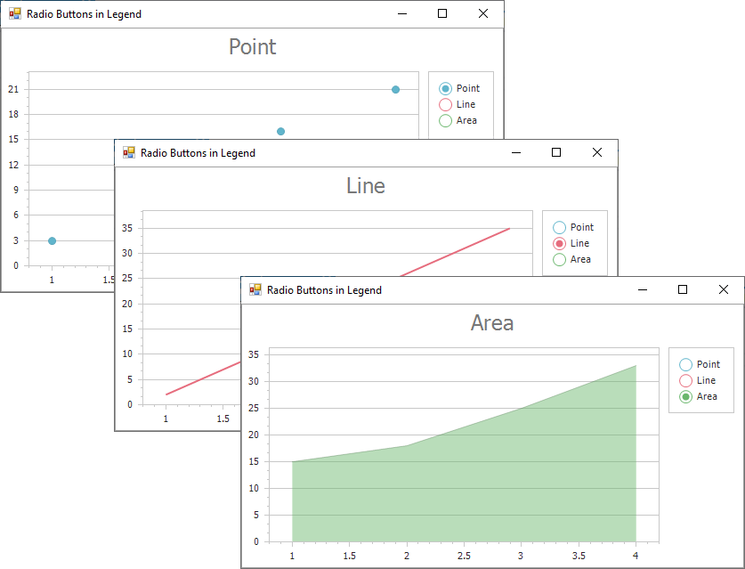

<!-- default badges list -->

<!-- default badges end -->

# Chart for WinForms - How to Create Custom Legend Radio Buttons to Control Visibility of a Chart Series

This example demonstrates how to show chart series (Point, Line, or Area) depending on the selection state of a custom radio button in the chart legend. 

Use the [ChartControl.CustomDrawSeries](https://docs.devexpress.com/WindowsForms/DevExpress.XtraCharts.ChartControl.CustomDrawSeries?v=22.2) event handler to create a custom appearance for radio buttons based on the color of a selected series. Handle the [ChartControl.LegendItemChecked](https://docs.devexpress.com/WindowsForms/DevExpress.XtraCharts.ChartControl.LegendItemChecked) event and use [e.CheckedElement](https://docs.devexpress.com/CoreLibraries/DevExpress.XtraCharts.LegendItemCheckedEventArgs.CheckedElement) and [SeriesBase.CheckedInLegend](https://docs.devexpress.com/CoreLibraries/DevExpress.XtraCharts.SeriesBase.CheckedInLegend) proeprties to show (or hide) the chart series when you switch between radio buttons. 

## Files to Review

* [MainForm.cs](./CS/MainForm.cs) (VB: [MainForm.vb](./VB/MainForm.vb))

## Documentation

[Legend Items](https://docs.devexpress.com/WindowsForms/115949/controls-and-libraries/chart-control/legends/legend-items?v=22.2&p=netframework)

## More Examples 

[Chart for WinForms - How to Add a Custom Item to a Legend](https://github.com/DevExpress-Examples/winforms-chart-add-a-custom-legend-item)

<!-- feedback -->
## Does this example address your development requirements/objectives?

 

(you will be redirected to DevExpress.com to submit your response)
<!-- feedback end -->
